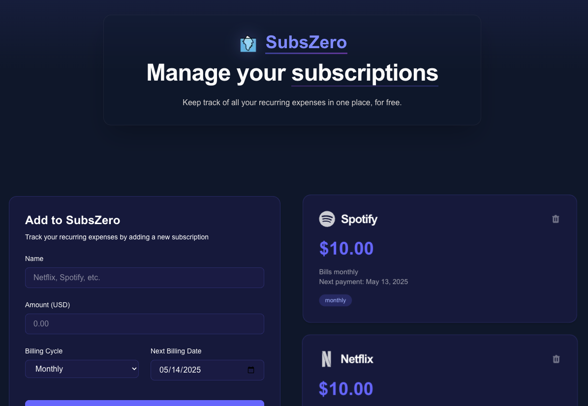

# SubsZero

A modern web application to help you track and manage your recurring subscriptions. Built with Next.js and React.

🔗 [Live Demo](https://subscriptions-alpha.vercel.app)



## Features

- 📊 Track monthly and yearly subscriptions
- 💰 Calculate total monthly and annual costs
- 🎨 Beautiful, modern UI with glass-morphism design
- 📱 Responsive layout for all devices
- 💾 Local storage persistence
- 🔍 Auto-detection of popular subscription services
- 🌙 Dark mode optimized

## Tech Stack

- [Next.js 15](https://nextjs.org/) - React Framework
- [React 19](https://react.dev/) - UI Library
- [React Icons](https://react-icons.github.io/react-icons/) - Icon Library
- [Framer Motion](https://www.framer.com/motion/) - Animation Library
- TypeScript - Type Safety
- Local Storage - Data Persistence

## Getting Started

First, clone the repository:

```bash
git clone https://github.com/adnjoo/subscriptions.git
cd subscriptions
```

Install dependencies:

```bash
npm install
# or
yarn
# or
pnpm install
```

Run the development server:

```bash
npm run dev
# or
yarn dev
# or
pnpm dev
```

Open [http://localhost:3000](http://localhost:3000) with your browser to see the result.

## Contributing

Contributions are welcome! Please feel free to submit a Pull Request.

## License

This project is licensed under the MIT License - see the [LICENSE](LICENSE) file for details.


Made with ❤️ by Drew123
